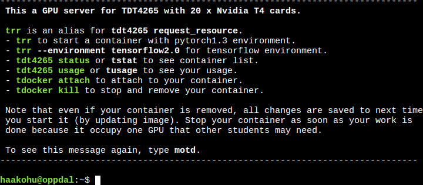
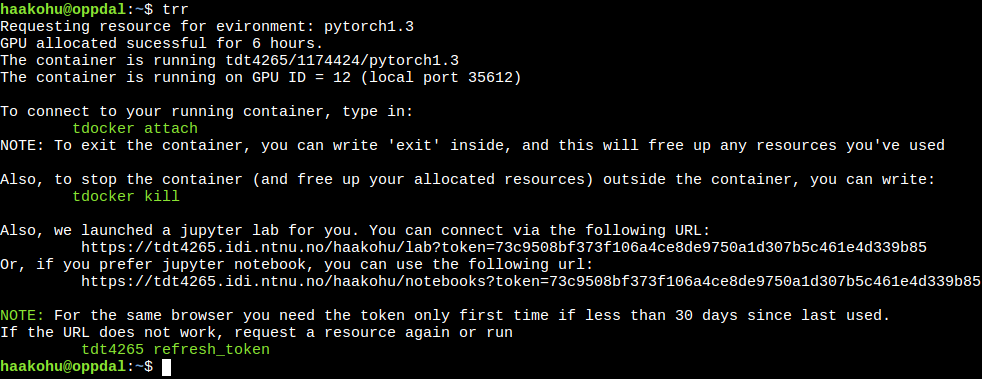
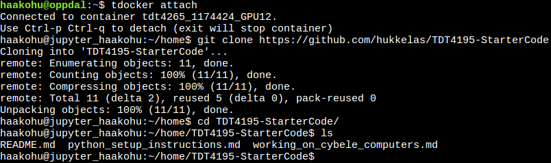
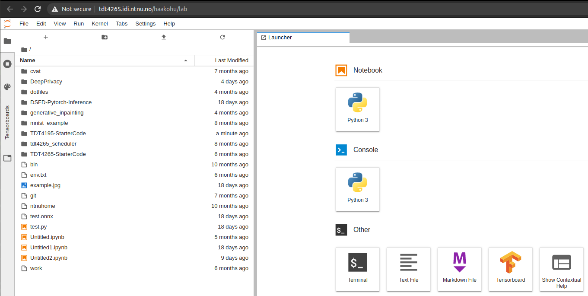

# Visual Computing Server
This server is used for exercises in TDT4265, TDT4265, and TDT17.

## Information

By logging into oppdal.idi.ntnu.no you will be able to launch JupyterLab or Jupyter Notebook with a reserved GPU, which will speed up deep learning activities significantly.
The system is only accessible from an NTNU IP address, so you will have to use VPN to access it from elsewhere.

## How to:

1. Log into the server, either through our [web interface](https://tdt4265.idi.ntnu.no/ssh/), or use ssh ("ssh [ntnu-username]@oppdal.idi.ntnu.no") with bash. When you've logged in, you should see something similiar to what below

2. Before starting on your assignment, you need to **request a resource**. Type "trr" in the bash terminal, and this will request a resource to be allocated to you for a certain time period.
    * This will start a *docker container*. This is a type of  virtual machine running on the server, such that you can do your assignment without being interrupted by others.
    * You can request different types of environments (for example tensorflow instead of pytorch), check out `trr -h`.

3. Now you have allocated a compute resource for a number of hours. To start your work, you can use the resource by clicking on the jupyter lab URL printed, or you can use `tdocker attach`.
    * `tdocker attach` connects your current terminal input/output to the docker container that we started for you. You need to use this if you want to run python scripts from the terminal.
    * To exit the container without deallocating your requested resources, use ctrl+p, ctrl+q to exit the container.

4. **Copy the starter code:** If you want to start on your assignments in TDT4265 (or TDT4265), you can clone the starter code with `git clone https://github.com/hukkelas/TDT4265-StarterCode`

5. This folder should now also be visible in the jupyter lab interface.

6. When you are done, **please stop your container** with `tdocker kill` (otuside the container), or type `exit` if you are inside the container. This will dellocate the resources that you reserved, and other users can use it!

## Time limitations
Since there are a lot more students than there are available GPUs, you are only able to reserve a GPU for a set amount of time, which will change according to the time of day.
-  `tstat`: Issuing the command `tstat` will display the status of the system, and if you request a reservation when no GPUs are available, you will be put into a **queue** (look into screen/tmux if you want to close your terminal window while waiting).
- Note that the amount of time you reserve a GPU for is logged, so make sure that you `tdocker kill` your workspace when you are done.
- You can check how much time you have reserved a GPU for until now with `tusage`, and to make it fair for everyone we might restrict access based on this if the demand gets high.
- Additionally, since you can only reserve the GPU for a set amount of time, your workspace will shut down when the reservation expires, so make sure that you save your model regularly if you are training for longer periods of time!

## Rules

Breaking any of the following rules can cause you to permanently loose access to the given compute resources.

- Running any jobs outside a docker container (using the given jupyter lab link is ofcourse allowed) is not allowed.
- Using the cluster for any jobs which are not part of TDT4265, TDT4265, or TDT17 is not allowed.
- A single group can only allocate one resource at a time.

## Directories within your docker container
The following folders in the docker container are available to you:

- `/home/[ntnu-username]/home`: The home directory from oppdal.
- `/work/datasets`: common datasets for courses
- `/home/[ntnu-username]/ntnu-home`: The NTNU home directory.

## Uploading files
You can upload files with the following methods:
- Use git (inside or outside the docker container).
- "Drag and drop" with the jupyter lab view.
- Synchronize files with tools suchas: rsync, sshfs, or whatever floats your boat.
- NTNU-Home: the ~/ntnu-home folder will be a symlink to your NTNU home directory

**NOTE:** We do not have a backup of your files on the server, so make sure to backup your work now and then (git is a good tool for this). Also, at the end of the semester we will delete all your files.

## Notes
As the system allocates a full GPU per user, you will be able to utilize the full GPU, which in turn makes it important that you try to only use the server for GPU intensive workloads (i.e. training your neural networks).
Debugging your code should preferably be done locally, and once you are sure you want to train to completion, you should move to oppdal (remember to double check that you move your training from CPU to GPU when you do this).

## Allocation specifications

Each compute resource allocation will have the following specification:

- 4 CPU cores @2.10Ghz
- NVIDIA T4 with 16GB of VRAM
- 16GB of RAM
